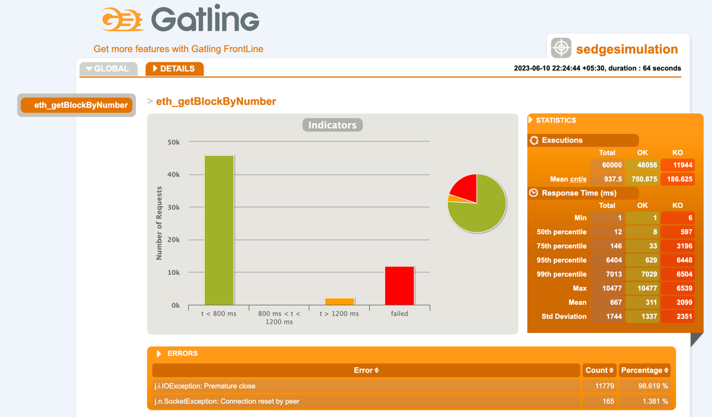

<a name="readme-top"></a>

<!-- PROJECT LOGO -->
<br />
<div align="center">
  <a href="https://github.com/shashankshampi/nethermind-perf">
    
  </a>

<h3 align="center">Nethermind-Perf</h3>

  <p align="center">
    An awesome DAY to jumpstart your day!
    <br />
    <a href="https://github.com/shashankshampi/nethermind-perf"><strong>Explore README »</strong></a>
    <br />
    <br />
  </p>
</div>


<!-- TABLE OF CONTENTS -->
<details open>
  <summary>Table of Contents</summary>
  <br>
  <ol>
    <li>
      <a href="#about-the-project">About The Project</a>
      <ul>
        <li><a href="#built-with">Built With</a></li>
      </ul>
    </li>
    <li>
      <a href="#getting-started">Getting Started</a>
      <ul>
        <li><a href="#prerequisites">Prerequisites</a></li>
        <li><a href="#installation">Installation</a></li>
      </ul>
    </li>
    <li>
      <a href="#assignment-report">Assignment Report</a>
      <ul>
        <li><a href="#test">JSON-RPC verification</a></li>
        <li><a href="#benchmark">JSON-RPC Benchmark</a></li>
      </ul>
    </li>
    <li><a href="#usage">Usage</a></li>
    <li><a href="#roadmap">Roadmap</a></li>
    <li><a href="#contributing">Contributing</a></li>
    <li><a href="#contact">Contact</a></li>
  </ol>
</details>


<!-- ABOUT THE PROJECT -->

## About The Project

[](https://github.com/shashankshampi/nethermind-perf)

The GitHub repository is a customized solution designed to perform both benchmarking and API verification and validation for Nethermind JSON-RPC. The repository utilizes Java and TestNG for verification and validation, while benchmarking is carried out using Java and Scala packages with Gatling support.

TestNG is a testing framework for Java that provides enhanced features for testing, such as grouping, parallel execution, and data-driven testing. More information about TestNG can be found in the [TestNG documentation](https://testng.org/doc/).

Gatling is a powerful open-source load testing tool designed for testing the performance of web applications. It supports scripting scenarios in Scala and provides detailed performance metrics and reports. Additional information about Gatling can be found in the [Gatling documentation](https://gatling.io/docs/gatling/)

For a comprehensive understanding of the assignment, please refer to the [Assignemnt](https://github.com/shashankshampi/nethermind-perf/docs/Senior-QA-Engineer-Task.pdf)

This repository combines the capabilities of TestNG and Gatling to verify and validate the Nethermind JSON-RPC API, while also conducting benchmarking tests. It serves as a versatile tool for evaluating the performance and functionality of the API, providing valuable insights for quality assurance.

[](https://testng.org/doc/) [](https://gatling.io/docs/gatling/)
[](https://github.com/shashankshampi/nethermind-perf/blob/main/docs/Senior-QA-Engineer-Task.pdf)
[](https://docs.sedge.nethermind.io/docs/intro)
[](https://github.com/NethermindEth/sedge/tree/main)

### Built With

Nethermind-Perf is build on the following Tech Stack.

* [](https://www.java.com/)
* [](https://maven.apache.org/)
* [](https://www.scala-lang.org/)
* [](https://github.com/NethermindEth/sedge/tree/main)
* [](https://gatling.io/docs/gatling/)

<p align="right">(<a href="#readme-top">back to top</a>)</p>

<!-- GETTING STARTED -->
## Getting Started

To start with this project you need to follow the steps as below.

### Prerequisites

Make sure you have the following software installed:

* [](https://www.java.com/)
* [](https://maven.apache.org/)
* [](https://www.scala-lang.org/)

### Installation

To set up the repository, follow these steps:

1. Clone the repository using the following command:
   ```sh
   git clone git@github.com:shashankshampi/nethermind-perf.git
   ```
2. Execute JSON-RPC verification tests with following command:
   ```sh
   mvn clean test
   ```

3. Execute JSON-RPC benchmark tests with command:
   ```sh
   mvn gatling:test
   ```
   To customize the number of users and the pattern, use the following command:

      ```sh
   mvn gatling:test -Denv=perf -DClassName=SedgeSimulation -DsimulationPattern="{"pattern":[{"type":"NOTHING_FOR","duration":5},{"type":"AT_ONCE_USERS","users":1},{"type":"RAMP_USERS","users":1,"duration":1},{"type":"CONSTANT_USERS_PER_SEC","users":1,"duration":1,"randomized":false},{"type":"RAMP_USERS_PER_SEC","users":1,"toUser":1,"duration":1,"randomized":false}]}"
   ```
   For more information about the pattern options, refer to the [Gatling documentation](https://gatling.io/docs/gatling/reference/current/core/injection/).


<p align="right">(<a href="#readme-top">back to top</a>)</p>

## Assignment Report

This section provides a comprehensive report on the test execution and benchmark results for the JSON-RPC API. 
It contains detailed information and analysis of the tests performed, including verification and validation of the API functionality. Additionally, benchmarking results are presented, offering insights into the performance of the JSON-RPC API.
The report serves as a valuable resource for evaluating the overall quality and efficiency of the API, providing essential information for further improvements and optimizations.

### JSON-RPC verification
All test in Given Checklist passes successfully without any error when executed locally.
The complete test report can be accessed as an HTML file using the following [Test Report](https://github.com/shashankshampi/nethermind-perf/blob/main/report/test/index.html)

Download `report/test` directory and open html file in Web Browser.

[](https://github.com/shashankshampi/nethermind-perf/blob/main/report/test/index.html)

### JSON-RPC Benchmark
In JSON-RPC API two iteration were executed under different simulation parameters.
1. Iteration 1 was executed with 3k request count with 100 user over 30 sec. Constant concurrency was maintained at 3.33 request/sec.
Detail execution report can be downloaded [Benchmark Report-Iteration-1](https://github.com/shashankshampi/nethermind-perf/tree/main/report/benchmark/gatling/sedgesimulation-20230610172743183)

[](https://github.com/shashankshampi/nethermind-perf/tree/main/report/benchmark/gatling/sedgesimulation-20230610172743183)

2. Iteration 2 was executed with 60k request count with 1000 user over 60 sec. Constant concurrency was maintained at 16.67 request/sec.
   Detail execution report can be downloaded [Benchmark Report-Iteration-2](https://github.com/shashankshampi/nethermind-perf/tree/main/report/benchmark/gatling/sedgesimulation-20230610165444248)

[](https://github.com/shashankshampi/nethermind-perf/tree/main/report/benchmark/gatling/sedgesimulation-20230610172743183)

The most common error encountered was "Premature close" with 11,779 occurrences (98.62% of failed requests), followed by "Connection reset by peer" with 165 occurrences (1.38% of failed requests).

<p align="right">(<a href="#readme-top">back to top</a>)</p>

<!-- USAGE EXAMPLES -->
## Usage

To access JSON-RPC API Postman collection can be downloaded via report directory

To get API contract or to try APIs with sample response, please refer to the [POSTMAN-COLLECTION](https://github.com/shashankshampi/nethermind-perf/tree/main/report/postman).
<div align="center">

</div>

<p align="right">(<a href="#readme-top">back to top</a>)</p>


<!-- ROADMAP -->
## Roadmap

- [x] Establish a private GitHub repository for this task.
- [x] Invite the specified members to the repository as collaborators upon completion.
- [x] Create a GitHub Action running on the ubuntu-latest machine. Install Sedge on the agent using the following commands:
- [x] Run Sedge tool using the provided commands to generate the necessary environment for testing.
- [x] Ensure client synchronization completed by creating a JSON-RPC call within the GitHub action that verifies the eth_syncing call
  returns “false”. (https://docs.nethermind.io/nethermind/ethereum-client/json-rpc/eth#eth_syncing).
- [x] Develop a test suite that includes the following tests:
  Test 1: JSON-RPC verification
  Retrieve the chain head from a synced node using the eth_blockNumber API call.
  (https://docs.nethermind.io/nethermind/ethereum-client/json-rpc/eth#eth_blocknumber).
- [x] Obtain block details using the eth_getBlockByNumber endpoint.(https://docs.nethermind.io/nethermind/ethereum-client/json-
    rpc/eth#eth_getblockbynumber). Ensure the response is not empty, contains block data, and is free of error information.
Prepare additional relevant scenarios.
- [x] Test 2: JSON-RPC Benchmark
Execute the getBlockByNumber endpoint for a selected block head (always using the same block number consistently).
Assess endpoint behavior when executed 1,000 and 10,000 times with different levels of parallelism, simulating high load by
multiple users on public JSON-RPC API.
Prepare a report based on the results.

- [x] Test 3: Test Suite Extension for Selected Endpoint
For any chosen JSON-RPC endpoint from the Nethermind documentation, prepare additional scenarios (both verification and
performance tests). https://docs.nethermind.io/nethermind/ethereum-client/json-rpc

See the [open issues](https://github.com/shashankshampi/nethermind-perf/issues) for a full list of proposed features (and known issues).

<p align="right">(<a href="#readme-top">back to top</a>)</p>


<!-- CONTRIBUTING -->

## Contributing

Contributions are what make the open source community such an amazing place to learn, inspire, and create. Any
contributions you make are **greatly appreciated**.

If you have a suggestion that would make this better, please fork the repo and create a pull request. You can also
simply open an issue with the tag "enhancement".
Don't forget to give the project a star! Thanks again!

1. Fork the Project
2. Create your Feature Branch (`git checkout -b feature/AmazingFeature`)
3. Commit your Changes (`git commit -m 'Add some AmazingFeature'`)
4. Push to the Branch (`git push origin git@github.com:shashankshampi/nethermind-perf.git`)
5. Open a Pull Request

<p align="right">(<a href="#readme-top">back to top</a>)</p>


<!-- CONTACT -->

## Contact

Developer - [LinkedIn](https://www.linkedin.com/in/shashanksanket/) - [Email](shashank.sanket1995@gmail.com)

<p align="right">(<a href="#readme-top">back to top</a>)</p>


<!-- MARKDOWN LINKS & IMAGES -->
<!-- https://www.markdownguide.org/basic-syntax/#reference-style-links -->
